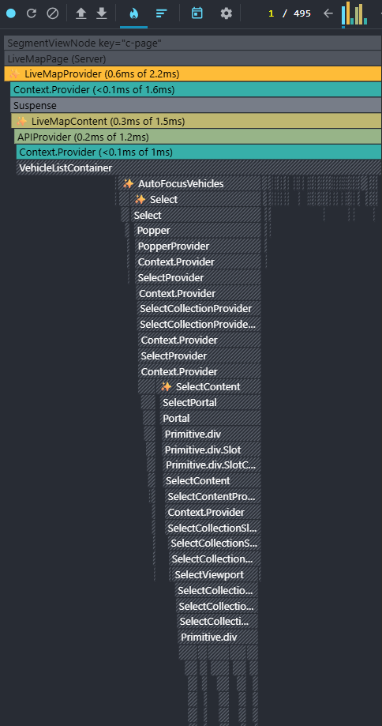
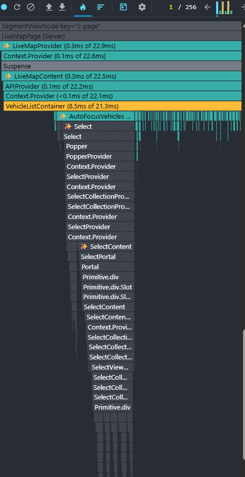
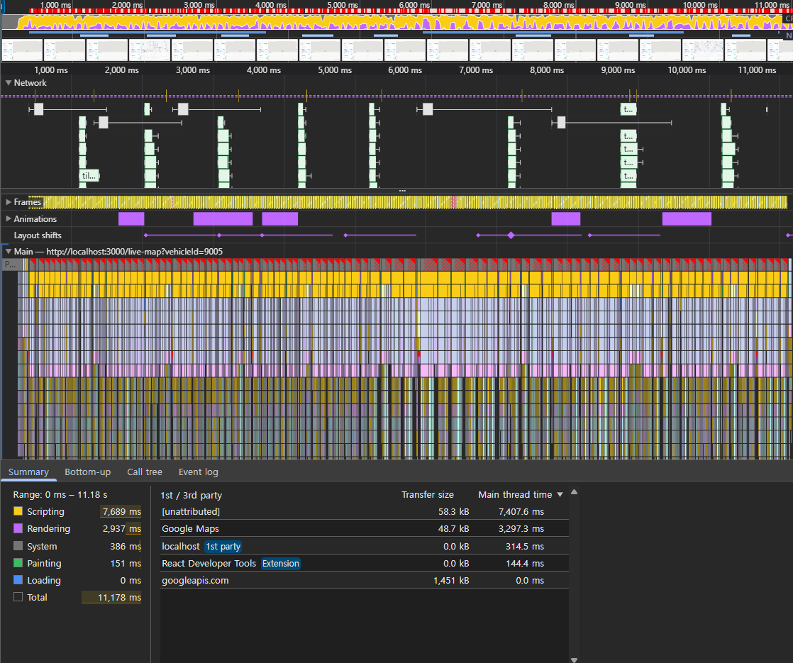
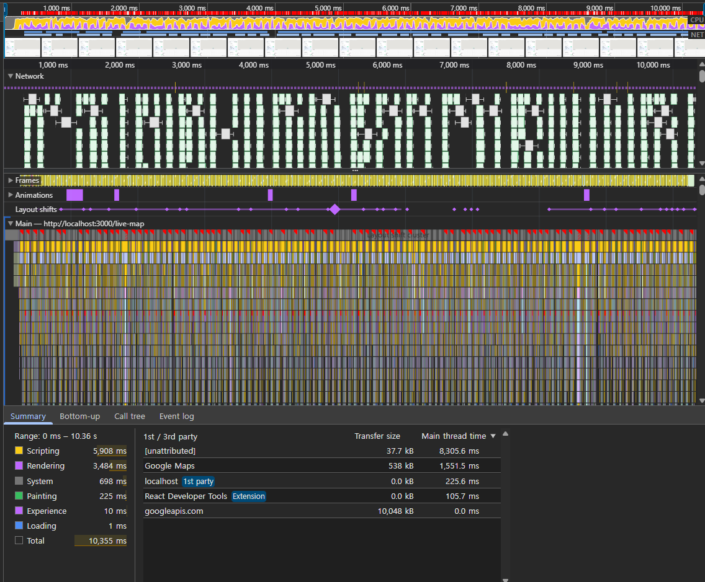

# 실시간 WebSocket 렌더링 최적화 — RAF 배칭 + Map 큐 + 데이터별 쓰로틀링

## 한줄 요약

초당 300건 WebSocket 데이터를 RAF 배칭으로 프레임당 1회 업데이트로 통합해 리렌더링 커밋 50% 감소, 저우선순위 데이터는 차량별 5초 쓰로틀 적용

---

## 배경

FMS(Fleet Management System)의 Live Map 페이지는 주행 중인 차량의 위치·타이어·AI 분석 데이터를 실시간으로 표시한다. 서버는 WebSocket을 통해 차량별로 5종의 이벤트를 지속적으로 전송한다.

| 이벤트                       | 내용                 | 빈도        |
| ---------------------------- | -------------------- | ----------- |
| `livemap:gps:updated`        | GPS 좌표, 속도, 방향 | 차량당 ~2초 |
| `livemap:tpms:updated`       | 타이어 압력, 온도    | 차량당 ~2초 |
| `livemap:ai:feature:updated` | AI 적재량 분석       | 차량당 ~2초 |
| `livemap:trip:started`       | 주행 시작            | 비정기      |
| `livemap:trip:completed`     | 주행 종료            | 비정기      |

실제 운영 환경은 차량당 약 1.5건/초(GPS·TPMS·Feature 각 ~2초 주기)이며, 최적화 전에는 이벤트마다 개별 `setState`를 호출하고 있어서 React가 매 이벤트마다 리렌더링 커밋을 생성했다.

**문제**: 이벤트 수에 비례해 리렌더링이 발생하고, 메인 스레드가 불필요한 렌더링에 점유되어 지도 애니메이션과 UI 반응성이 저하됨.

---

## 설계 1: RAF 기반 배칭 큐

### 핵심 아이디어

이벤트가 도착할 때마다 렌더링하지 않고, **큐에 모아두고 다음 브라우저 페인트 직전에 한 번에 반영**한다. setTimeout/debounce가 아닌 RAF를 선택한 이유는 렌더링 타이밍을 브라우저 페인트 사이클에 정확히 맞추기 위해서다.

```
이벤트 도착 → 큐에 적재 → RAF 콜백에서 일괄 flush → setState 1회
```

### 큐 구조: Map으로 중복 덮어쓰기

큐는 이벤트 타입별 5개 `Map`으로 구성했다. 키는 `vehicleId`다.

```ts
const updateQueueRef = useRef({
  gps: new Map(), // vehicleId → 최신 GPS 데이터
  tripStarted: new Map(), // vehicleId → trip 시작 데이터
  tripCompleted: new Map(), // vehicleId → trip 완료 데이터
  tpms: new Map(), // vehicleId → 최신 TPMS 데이터
  feature: new Map(), // vehicleId → 최신 AI Feature 데이터
});
```

**Map을 선택한 이유**: 같은 차량의 GPS가 한 프레임(16ms) 안에 2번 들어오면, 두 번째 데이터가 첫 번째를 덮어쓴다. 배열이었으면 둘 다 처리해야 하지만, Map은 **자동으로 최신값만 유지**한다.

### 이벤트 핸들러: 큐에 적재만

```ts
// GPS 이벤트 수신 → 큐에 넣고 RAF 예약
socketManager.addEventListener("livemap:gps:updated", (event) => {
  const key = `${event.data.vehicleId}`;
  updateQueueRef.current.gps.set(key, event.data);
  scheduleUpdate(); // RAF가 아직 예약 안 됐으면 예약
});
```

이벤트 핸들러는 **큐에 넣고 끝**이다. setState를 호출하지 않으므로 리렌더링이 발생하지 않는다.

### RAF 스케줄러: 프레임당 최대 1회

```ts
const scheduleUpdate = () => {
  if (rafIdRef.current === null) {
    rafIdRef.current = requestAnimationFrame(() => {
      flushUpdates();
      rafIdRef.current = null;
    });
  }
};
```

`rafIdRef`가 이미 예약되어 있으면 중복 예약하지 않는다. 한 프레임 안에 이벤트가 10개 들어와도 **RAF 콜백은 1번만 실행**된다.

### flush: 큐를 비우고 setState 1회

```ts
const flushUpdates = () => {
  const queue = updateQueueRef.current;

  flushMapUpdates(queue); // 지도용 상태 업데이트
  flushListUpdates(queue); // 목록용 상태 업데이트

  // 큐 초기화
  updateQueueRef.current = {
    gps: new Map(),
    tripStarted: new Map(),
    tripCompleted: new Map(),
    tpms: new Map(),
    feature: new Map(),
  };
};
```

`flushMapUpdates`와 `flushListUpdates`는 각각 `setMapTrips`, `setListTrips`를 **1회씩** 호출한다. 큐에 쌓인 모든 차량의 업데이트가 하나의 setState에 합쳐진다.

### hasChanges 패턴: 불필요한 렌더 방지

```ts
const flushMapUpdates = (queue) => {
  setMapTrips((prev) => {
    const updated = new Map(prev);
    let hasChanges = false;

    queue.gps.forEach((gpsData, key) => {
      const existing = updated.get(key);
      if (existing) {
        updated.set(key, { ...existing, ...gpsData });
        hasChanges = true;
      }
    });

    // ... 나머지 이벤트 타입도 동일 패턴

    return hasChanges ? updated : prev; // 변경 없으면 이전 참조 반환 → 리렌더 스킵
  });
};
```

큐에 데이터가 있어도 실제로 Map에 반영할 대상이 없으면(이미 trip이 완료된 차량 등) **이전 Map 참조를 그대로 반환**하여 불필요한 리렌더를 방지한다.

---

## 설계 2: 데이터 우선순위별 쓰로틀링

모든 데이터가 동일한 빈도로 UI에 반영될 필요는 없다. **사용자가 실시간 변화를 체감하는 정도**에 따라 우선순위를 나눴다.

| 데이터         | 우선순위 | 근거                                       | 전략                     |
| -------------- | -------- | ------------------------------------------ | ------------------------ |
| GPS            | 높음     | 지도 위 차량 이동을 눈으로 추적            | RAF 배칭만 (쓰로틀 없음) |
| Trip 시작/종료 | 높음     | 차량 상태 변경은 즉시 반영 필요            | RAF 배칭만 (쓰로틀 없음) |
| TPMS (타이어)  | 낮음     | 테이블에 숫자로 표시, 1~2초 차이 체감 불가 | **차량별 5초 쓰로틀**    |
| AI Feature     | 낮음     | 적재량 분석값, 실시간 갱신 불필요          | **차량별 5초 쓰로틀**    |

### 구현: flush 시점에서 시간 비교

```ts
// TPMS 업데이트 (5초 throttle)
queue.tpms.forEach((tpmsData, key) => {
  const lastUpdate = lastTpmsUpdateRef.current.get(key) || 0;
  if (now - lastUpdate >= 5000) {
    // ... 상태 업데이트
    lastTpmsUpdateRef.current.set(key, now);
  }
  // 5초 미만이면 무시 — 다음 이벤트에서 최신값이 다시 큐에 들어옴
});
```

쓰로틀은 이벤트 수신 시점이 아니라 **flush 시점**에서 체크한다. 큐에는 항상 최신값이 덮어쓰기로 유지되고 있으므로, 5초 후 flush될 때 가장 최신 데이터가 반영된다.

---

## 설계 3: 상태 분리 — mapTrips / listTrips

지도 컴포넌트와 차량 목록 컴포넌트가 필요한 데이터가 다르다.

| 상태        | 소비자             | 포함 데이터             |
| ----------- | ------------------ | ----------------------- |
| `mapTrips`  | 지도 (Google Maps) | GPS 좌표, 방향, 속도    |
| `listTrips` | 차량 목록 테이블   | GPS + TPMS + AI Feature |

```ts
const [mapTrips, setMapTrips] = useState<Map<string, MapTripData>>(new Map());
const [listTrips, setListTrips] = useState<Map<string, ListTripData>>(
  new Map(),
);
```

분리한 이유: TPMS/Feature가 5초 쓰로틀로 업데이트되면 `listTrips`만 변경된다. `mapTrips`는 변경되지 않으므로 **지도 컴포넌트는 리렌더하지 않는다.** GPS 업데이트는 양쪽 모두 변경하지만, 이 경우에도 각 컴포넌트는 자신이 구독한 상태만 받는다.

---

## 데이터 흐름 요약

```
WebSocket 이벤트
    ↓
이벤트 핸들러 (큐에 적재만, setState 없음)
    ↓
Map 큐 (vehicleId 키, 최신값 덮어쓰기)
    ↓
requestAnimationFrame (프레임당 1회)
    ↓
flushUpdates
    ├── GPS, Trip: 즉시 반영
    └── TPMS, Feature: 5초 쓰로틀 체크 후 반영
    ↓
setMapTrips (지도용) + setListTrips (목록용) — 각 1회
    ↓
React 리렌더링 (프레임당 최대 1커밋)
```

---

## 측정 결과

실제 운영 환경은 차량당 약 1.5건/초이며, 확장성 검증을 위해 차량당 10건/초로 부하를 가중한 시뮬레이션 환경에서 측정했다.

### React DevTools Profiler (30대, 초당 300 이벤트, 10초)

|                  | Before | After | 변화     |
| ---------------- | ------ | ----- | -------- |
| 리렌더링 커밋 수 | 495회  | 256회 | **-48%** |

> Before: RAF 배칭 없이 이벤트마다 직접 setState를 호출하는 구조에서 측정.

<a href="./images/profiler-before.png">
  
</a>

_Before: 10초간 495회 커밋 발생_

<a href="./images/profiler-after.png">
  
</a>

_After: 10초간 256회 커밋으로 감소_

### Chrome Performance (10대, 초당 100 이벤트, ~10초)

Profiler는 커밋 수 측정이 목적이라 부하를 높게 설정, Performance는 타임라인 가독성을 위해 낮게 설정했다.

|           | Before  | After   | 변화     |
| --------- | ------- | ------- | -------- |
| Scripting | 7,689ms | 5,908ms | **-23%** |
| Rendering | 2,937ms | 3,484ms | +18%     |
| Painting  | 151ms   | 225ms   | +49%     |

<a href="./images/performance-before.png">
  
</a>

_Before: 메인 스레드가 Scripting에 점유되어 프레임 생산 불가_

<a href="./images/performance-after.png">
  
</a>

_After: Scripting 부하 감소, 메인 스레드에 여유가 생겨 프레임 정상 생산_

**Rendering/Painting 증가 해석**: Scripting(JS 실행) 시간이 줄어 메인 스레드에 여유가 생겼고, 그만큼 브라우저가 **렌더링 파이프라인을 더 자주 실행**할 수 있게 됐다. Before에서는 JS가 메인 스레드를 독점해 프레임 자체를 생산하지 못했다. 즉, Rendering/Painting 증가는 성능 저하가 아니라 JS 독점이 해소된 결과다.

---

## 결과

| 구분           | Before                    | After                                              |
| -------------- | ------------------------- | -------------------------------------------------- |
| 이벤트 처리    | 이벤트마다 개별 setState  | RAF 큐에서 프레임당 1회 일괄 처리                  |
| 중복 데이터    | 같은 차량 GPS가 중복 렌더 | Map 키로 자동 덮어쓰기, 최신값만 반영              |
| TPMS/Feature   | 매 이벤트 즉시 반영       | 차량별 5초 쓰로틀, 체감 차이 없는 갱신 제거        |
| 상태 구조      | 단일 상태                 | mapTrips/listTrips 분리, 불필요한 교차 리렌더 방지 |
| 리렌더링 커밋  | 10초간 495회              | 10초간 256회 (**48% 감소**)                        |
| Scripting 비용 | 7,689ms                   | 5,908ms (**23% 감소**)                             |
